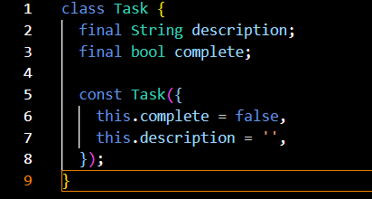
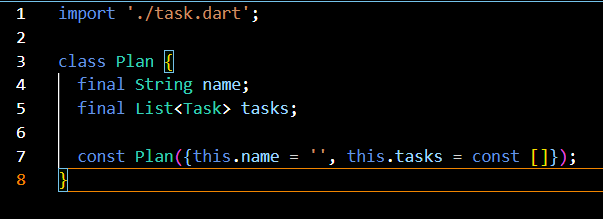
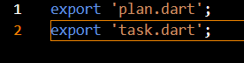
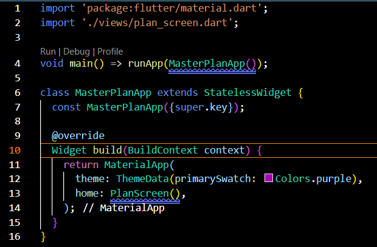
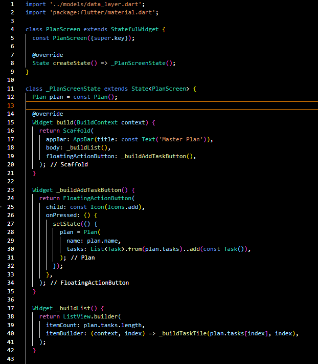
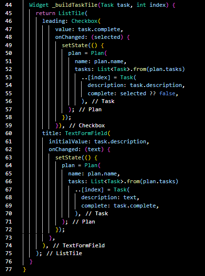
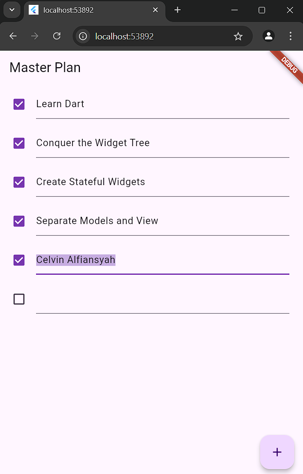
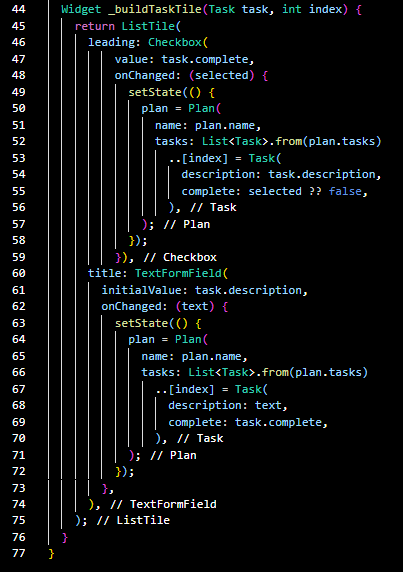

# Tugas Praktikum 1: Dasar State dengan Model-View

Praktikum Flutter Model View

## Celvin Alfiansyah
## 362358302104
## 2D TRPL

# Soal
1. Selesaikan langkah-langkah praktikum tersebut, lalu dokumentasikan berupa GIF hasil
akhir praktikum beserta penjelasannya di file README.md! Jika Anda menemukan ada
yang error atau tidak berjalan dengan baik, silakan diperbaiki.
2. Jelaskan maksud dari langkah 4 pada praktikum tersebut! Mengapa dilakukan
demikian?
3. Mengapa perlu variabel plan di langkah 6 pada praktikum tersebut? Mengapa dibuat
konstanta ?
4. Lakukan capture hasil dari Langkah 9 berupa GIF, kemudian jelaskan apa yang telah
Anda buat!
5. Apa kegunaan method pada Langkah 11 dan 13 dalam lifecyle state ?
6. Kumpulkan laporan praktikum Anda berupa link commit atau repository GitHub ke
spreadsheet yang telah disediakan!

# Jawab
1. Dokumentasi dan penjelasan
A. Langkah Pertama membuat Proyek flutter baru 

B. Membuat model task.dart pada lib/models lalu dalam file task.dart memasukkan code seperti ini

C. Membuat model plan.dart pada lib/models lalu dalam file plan.dart memasukkan code seperti ini

D. Membuat model data_layer.dart pada lib/models lalu dalam file data_layer.dart memasukkan code seperti ini

E. Mengedit File yang ada pada main.dart yang terdapat pada folder lib

F. Membuat view plan_screen.dart pada lib/views lalu dalam file plan_screen.dart memasukkan code seperti ini

Setelah Semuanya selesai maka hasil yang akan muncul akan seperti ini :

2. Langkah ini bertujuan untuk mengelola dan mengatur impor model dengan lebih efisien. Dengan membuat file data_layer.dart yang mengimpor kedua model (plan.dart dan task.dart), kita dapat:
A. Mempermudah Impor: Dengan adanya data_layer.dart, kita bisa mengimpor kedua model tersebut hanya dengan satu baris kode di file lain. Ini membuat kode lebih bersih dan mengurangi kemungkinan kesalahan atau kelupaan mengimpor salah satu model.
B. Sentralisasi: Ini menciptakan titik sentral untuk semua impor terkait data. Jika di masa depan ada perubahan atau penambahan model baru, kita hanya perlu memperbarui data_layer.dart dan tidak perlu mencari dan mengubah semua file yang mengimpor model-model tersebut.

3. Variabel plan diperlukan untuk menyimpan data terkait daftar tugas yang akan ditampilkan dan dikelola di dalam aplikasi. plan adalah sebuah instance dari kelas Plan yang menyimpan informasi tentang rencana dan daftar tugas yang terkait dengan rencana tersebut. Dengan adanya variabel plan, kita dapat mengelola state aplikasi dan memperbarui UI berdasarkan perubahan data di dalam variabel tersebut.
Variabel plan dideklarasikan sebagai konstanta (const) untuk alasan berikut: Dengan menjadikannya konstanta, kita memastikan bahwa nilai awal dari plan tidak akan berubah secara tidak sengaja setelah inisialisasi. Hal ini membantu menjaga konsistensi data dan menghindari bug yang mungkin muncul karena perubahan data yang tidak disengaja.

4. Langkah 9: Membuat Widget _buildTaskTile

Penjelasan: 
A. Checkbox: Menampilkan kotak centang untuk setiap tugas. Ketika status kotak centang diubah, state aplikasi diperbarui untuk mencerminkan apakah tugas tersebut sudah selesai atau belum.
B. TextFormField: Menampilkan deskripsi tugas. Ketika teks dalam TextFormField diubah, state aplikasi diperbarui untuk mencerminkan deskripsi tugas yang baru.
C. setState: Digunakan untuk memperbarui state aplikasi dan memicu rebuild pada widget sehingga UI dapat mencerminkan perubahan data.

5. Kegunaan initState():
A. Inisialisasi: Method initState() dipanggil sekali ketika objek State pertama kali dibuat. Ini digunakan untuk melakukan inisialisasi yang hanya perlu dilakukan sekali.
B. ScrollController: Diinisialisasi di sini untuk mengontrol perilaku scroll dari ListView. Listener ditambahkan untuk menghapus fokus dari semua TextField ketika event scroll terjadi.
Kegunaan dispose():
A. Pembersihan: Method dispose() dipanggil ketika objek State dihapus secara permanen. Ini digunakan untuk membersihkan resource yang digunakan oleh State, seperti controller yang tidak lagi diperlukan.
B. ScrollController: Di-dispose di sini untuk melepaskan resource yang digunakan oleh ScrollController, mencegah kebocoran memori.