# Tugas Praktikum 1: Dasar State dengan Model-View

## Celvin Alfiansyah
## 362358302104
## 2D TRPL

# Soal
1. Selesaikan langkah-langkah praktikum tersebut, lalu dokumentasikan berupa GIF hasil
akhir praktikum beserta penjelasannya di file README.md! Jika Anda menemukan ada
yang error atau tidak berjalan dengan baik, silakan diperbaiki.
2. Jelaskan maksud dari langkah 4 pada praktikum tersebut! Mengapa dilakukan
demikian?
3. Mengapa perlu variabel plan di langkah 6 pada praktikum tersebut? Mengapa dibuat
konstanta ?
4. Lakukan capture hasil dari Langkah 9 berupa GIF, kemudian jelaskan apa yang telah
Anda buat!
5. Apa kegunaan method pada Langkah 11 dan 13 dalam lifecyle state ?
6. Kumpulkan laporan praktikum Anda berupa link commit atau repository GitHub ke
spreadsheet yang telah disediakan!

# Jawab
1. Dokumentasi dan penjelasan
A. Langkah Pertama membuat Proyek flutter baru 

B. Membuat model task.dart pada lib/models lalu dalam file task.dart memasukkan code seperti ini

C. Membuat model plan.dart pada lib/models lalu dalam file plan.dart memasukkan code seperti ini

D. Membuat model data_layer.dart pada lib/models lalu dalam file data_layer.dart memasukkan code seperti ini

E. Mengedit File yang ada pada main.dart yang terdapat pada folder lib

F. Membuat view plan_screen.dart pada lib/views lalu dalam file plan_screen.dart memasukkan code seperti ini

Setelah Semuanya selesai maka hasil yang akan muncul akan seperti ini :

2. Langkah ini bertujuan untuk mengelola dan mengatur impor model dengan lebih efisien. Dengan membuat file data_layer.dart yang mengimpor kedua model (plan.dart dan task.dart), kita dapat:

A. Mempermudah Impor: Dengan adanya data_layer.dart, kita bisa mengimpor kedua model tersebut hanya dengan satu baris kode di file lain. Ini membuat kode lebih bersih dan mengurangi kemungkinan kesalahan atau kelupaan mengimpor salah satu model.

B. Sentralisasi: Ini menciptakan titik sentral untuk semua impor terkait data. Jika di masa depan ada perubahan atau penambahan model baru, kita hanya perlu memperbarui data_layer.dart dan tidak perlu mencari dan mengubah semua file yang mengimpor model-model tersebut.

3. Variabel plan diperlukan untuk menyimpan data terkait daftar tugas yang akan ditampilkan dan dikelola di dalam aplikasi. plan adalah sebuah instance dari kelas Plan yang menyimpan informasi tentang rencana dan daftar tugas yang terkait dengan rencana tersebut. Dengan adanya variabel plan, kita dapat mengelola state aplikasi dan memperbarui UI berdasarkan perubahan data di dalam variabel tersebut.
Variabel plan dideklarasikan sebagai konstanta (const) untuk alasan berikut: Dengan menjadikannya konstanta, kita memastikan bahwa nilai awal dari plan tidak akan berubah secara tidak sengaja setelah inisialisasi. Hal ini membantu menjaga konsistensi data dan menghindari bug yang mungkin muncul karena perubahan data yang tidak disengaja.

4. Langkah 9: Membuat Widget _buildTaskTile

Penjelasan: 

A. Checkbox: Menampilkan kotak centang untuk setiap tugas. Ketika status kotak centang diubah, state aplikasi diperbarui untuk mencerminkan apakah tugas tersebut sudah selesai atau belum.

B. TextFormField: Menampilkan deskripsi tugas. Ketika teks dalam TextFormField diubah, state aplikasi diperbarui untuk mencerminkan deskripsi tugas yang baru.

C. setState: Digunakan untuk memperbarui state aplikasi dan memicu rebuild pada widget sehingga UI dapat mencerminkan perubahan data.

5. Kegunaan initState():

A. Inisialisasi: Method initState() dipanggil sekali ketika objek State pertama kali dibuat. Ini digunakan untuk melakukan inisialisasi yang hanya perlu dilakukan sekali.

B. ScrollController: Diinisialisasi di sini untuk mengontrol perilaku scroll dari ListView. Listener ditambahkan untuk menghapus fokus dari semua TextField ketika event scroll terjadi.

Kegunaan dispose():

A. Pembersihan: Method dispose() dipanggil ketika objek State dihapus secara permanen. Ini digunakan untuk membersihkan resource yang digunakan oleh State, seperti controller yang tidak lagi diperlukan.

B. ScrollController: Di-dispose di sini untuk melepaskan resource yang digunakan oleh ScrollController, mencegah kebocoran memori.

# Praktikum 2: Mengelola Data Layer dengan InheritedWidget dan InheritedNotifier

# Soal

1. Selesaikan langkah-langkah praktikum tersebut, lalu dokumentasikan berupa GIF hasil
akhir praktikum beserta penjelasannya di file README.md! Jika Anda menemukan ada
yang error atau tidak berjalan dengan baik, silakan diperbaiki sesuai dengan tujuan
aplikasi tersebut dibuat.
2. Jelaskan mana yang dimaksud InheritedWidget pada langkah 1 tersebut! Mengapa
yang digunakan InheritedNotifier?
3. Jelaskan maksud dari method di langkah 3 pada praktikum tersebut! Mengapa
dilakukan demikian?
4. Lakukan capture hasil dari Langkah 9 berupa GIF, kemudian jelaskan apa yang telah
Anda buat!
5. Kumpulkan laporan praktikum Anda berupa link commit atau repository GitHub ke
spreadsheet yang telah disediakan!

# Jawab 
1. Dokumentasi dan Penjelasan

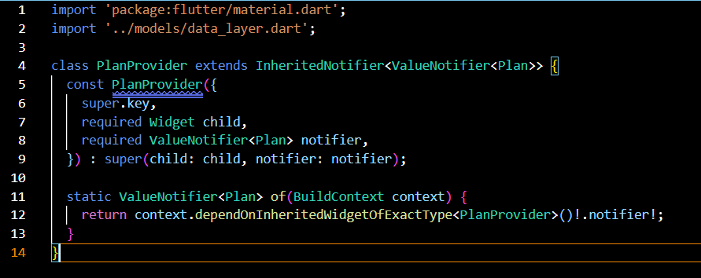

A. Membuat folder provider lalu menambahkan file plan_provider.dart lalu memasukkan code seperti ini

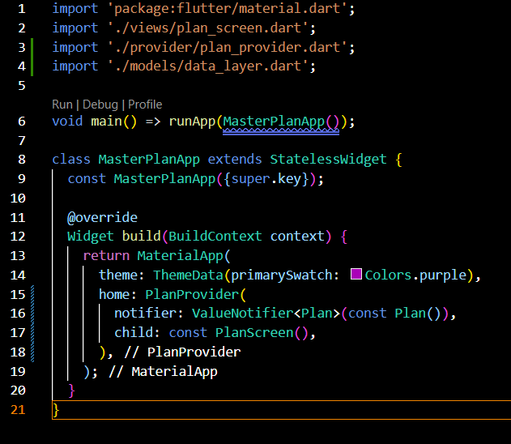

B. Mengedit code yang ada pada main.dart seperti ini

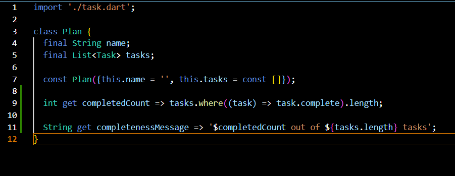

C. Menambahkan Method pada plan.dart seperti ini

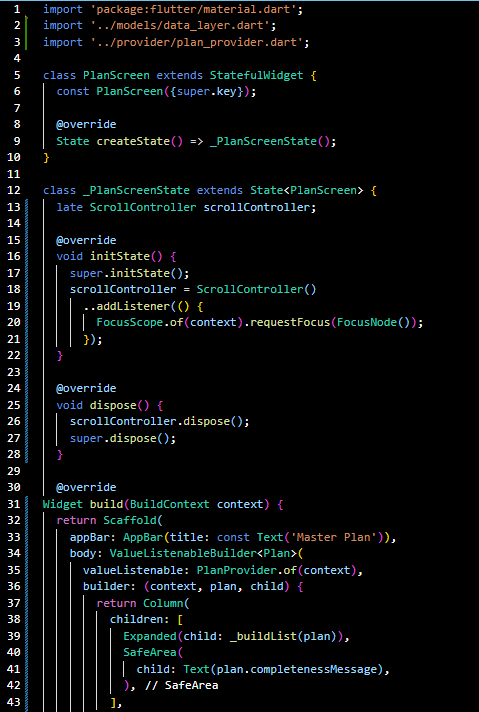

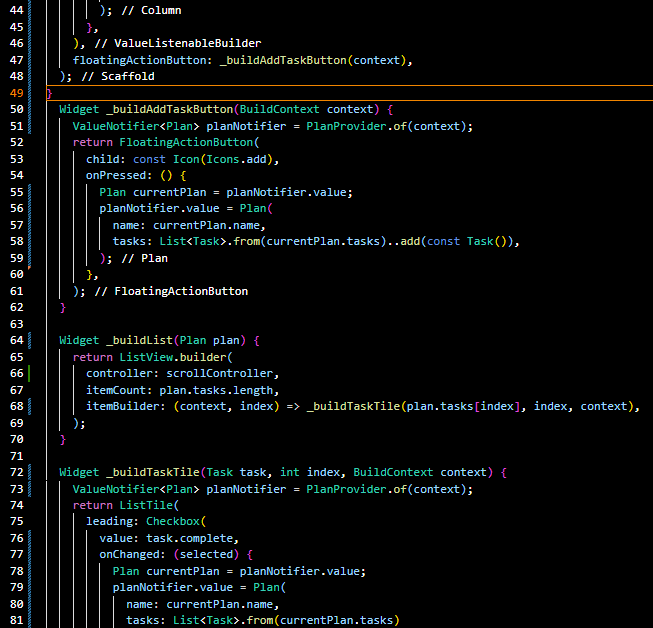

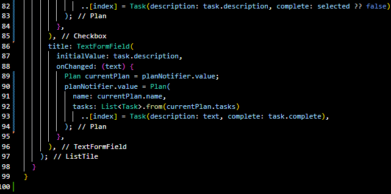

D. Mengedit file plan_screen.dart pada views seperti ini

2. Jelaskan mana yang dimaksud InheritedWidget pada langkah 1 tersebut! Mengapa yang digunakan InheritedNotifier?

A. InheritedWidget adalah widget yang digunakan untuk mengelola state dan memungkinkan state tersebut diakses oleh widget-widget turunannya. Pada langkah 1, PlanProvider adalah contoh InheritedWidget yang digunakan untuk menyediakan state Plan kepada widget-widget turunannya.

B. InheritedNotifier adalah subclass dari InheritedWidget yang menambahkan dukungan untuk ValueNotifier, memungkinkan update yang lebih efisien pada state. InheritedNotifier digunakan untuk memperbarui state hanya ketika ValueNotifier berubah, mengurangi kebutuhan untuk rebuild seluruh subtree.

3. Jelaskan maksud dari method di langkah 3 pada praktikum tersebut! Mengapa dilakukan demikian?

A.completedCount: Menghitung jumlah tugas yang telah diselesaikan.

B.completenessMessage: Menghasilkan pesan yang menunjukkan berapa banyak tugas yang telah diselesaikan dari total tugas.

Method-method ini ditambahkan untuk memudahkan perhitungan dan tampilan progress penyelesaian tugas di UI. Dengan cara ini, kita dapat dengan mudah mendapatkan informasi tentang status penyelesaian tugas tanpa harus menghitung ulang setiap kali diperlukan.

4. Langkah 9: Tambah widget SafeArea

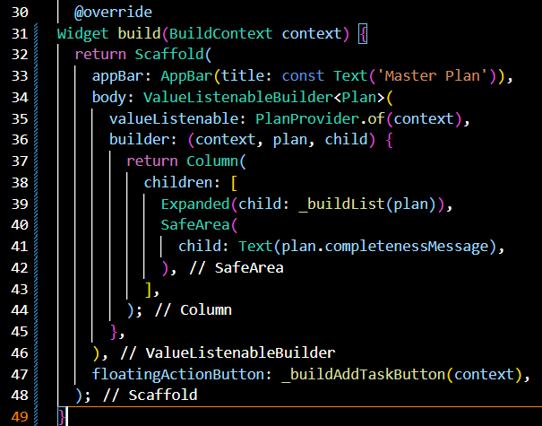

Langkah 9 menambahkan widget SafeArea untuk menampilkan pesan kemajuan penyelesaian tugas. Anda dapat membuat GIF yang menunjukkan tampilan aplikasi yang menampilkan daftar tugas dengan checkbox dan input teks, serta pesan kemajuan di bagian bawah.

# Praktikum 3: Membuat State di Multiple Screens

# Soal

1. Selesaikan langkah-langkah praktikum tersebut, lalu dokumentasikan berupa GIF hasil
akhir praktikum beserta penjelasannya di file README.md! Jika Anda menemukan ada
yang error atau tidak berjalan dengan baik, silakan diperbaiki sesuai dengan tujuan
aplikasi tersebut dibuat.
2. Berdasarkan Praktikum 3 yang telah Anda lakukan, jelaskan maksud dari gambar
diagram berikut ini!
3. Lakukan capture hasil dari Langkah 14 berupa GIF, kemudian jelaskan apa yang telah
Anda buat!
4. Kumpulkan laporan praktikum Anda berupa link commit atau repository GitHub ke
spreadsheet yang telah disediakan!

# Jawab
1. Dokumentasi dan Penjelasan

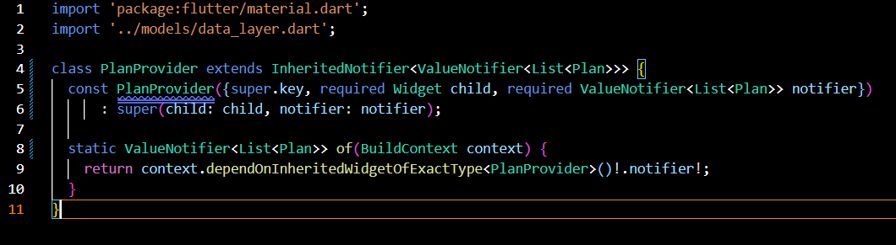

A. Mengedit kode yang ada pada plan_provider.dart yang berada pada folder provider seperti ini

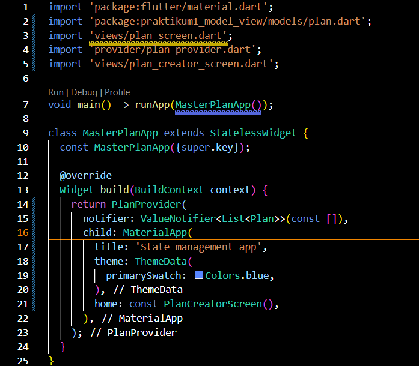

B. Mengedit kode yang ada pada main.dart seperti ini

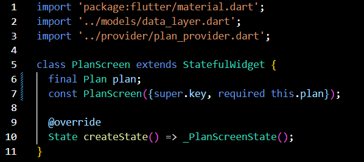

C. Mengedit kode pada plan_screen.dart dengan menambahkan variabel plan dan atribut pada constructornya

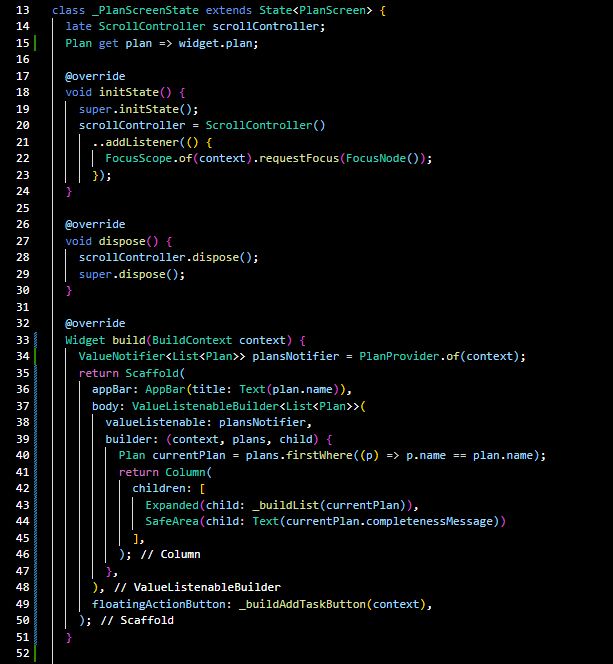

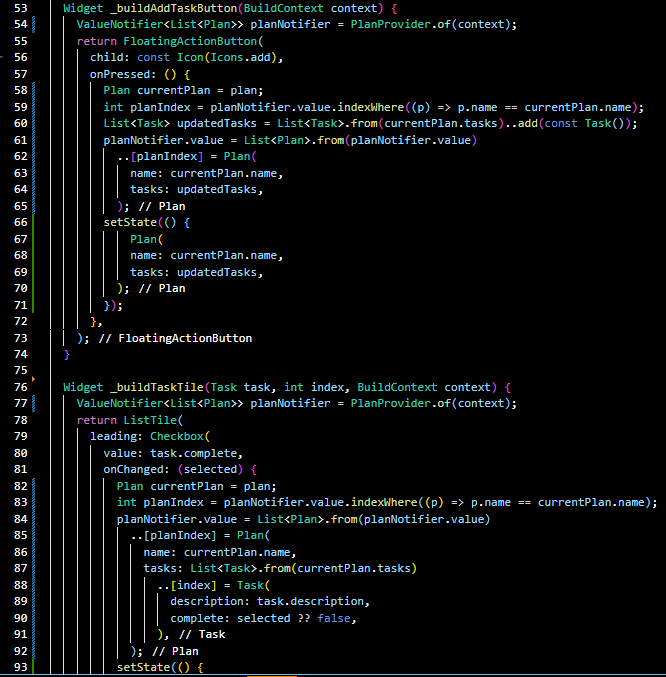

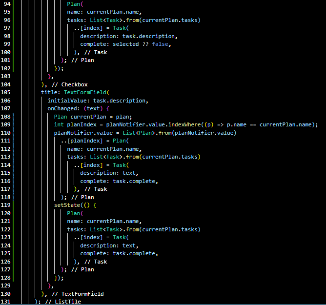

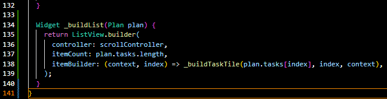

D. Perbaiki error yang terjadi setiap kali memanggil PlanProvider.of(context). Tambahkan getter pada _PlanScreenState

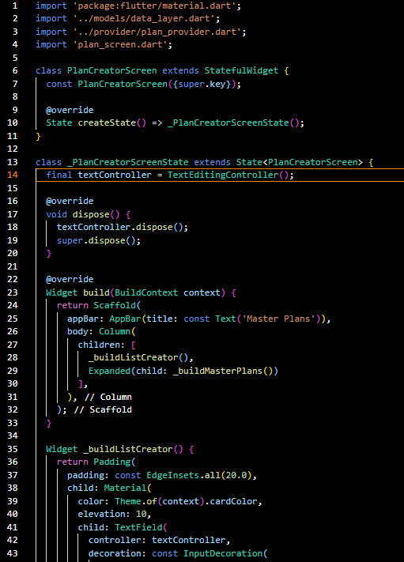

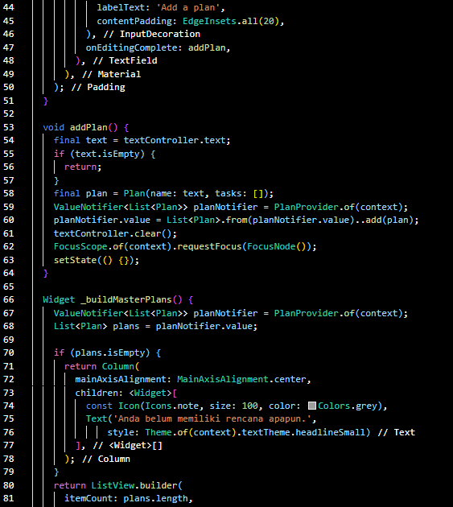

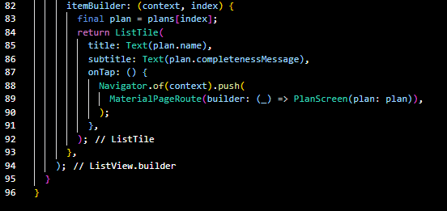

E. Membuat File baru pada views yaitu plan_creator_screen.dart lalu memasukkan kode seperti ini

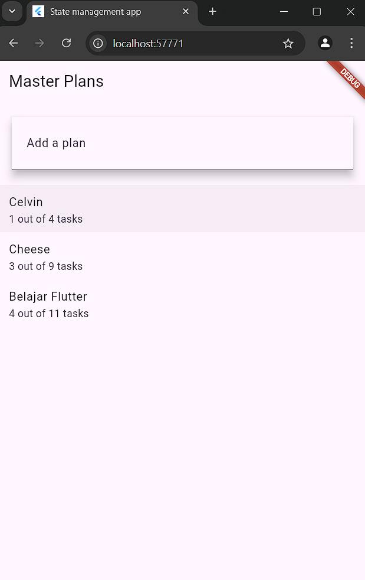

F. Maka Hasil webnya akan seperti ini

2. Berdasarkan praktikum yang telah Anda lakukan, jelaskan maksud dari diagram yang menggambarkan arsitektur state management yang Anda terapkan. Jelaskan bagaimana InheritedWidget, ValueNotifier, dan berbagai komponen berinteraksi dalam aplikasi Anda.

3. Langkah 14: Buat widget _buildMasterPlans()

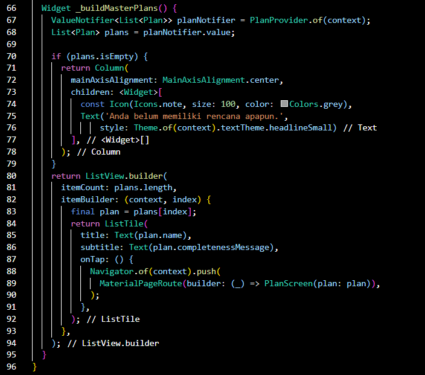

Langkah 14 menambahkan widget _buildMasterPlans untuk menampilkan daftar rencana yang telah dibuat dan memungkinkan pengguna untuk menambah rencana baru. Anda dapat membuat GIF yang menunjukkan tampilan aplikasi yang menampilkan daftar rencana dan memungkinkan penambahan rencana baru.